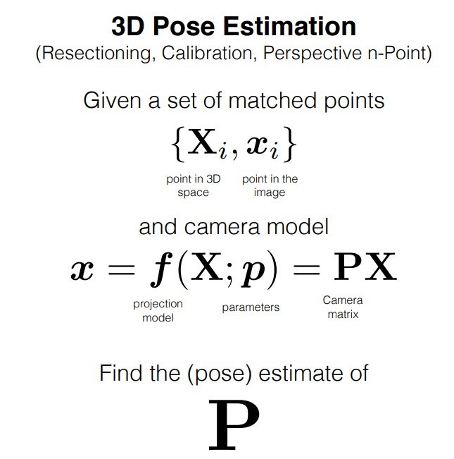

# Pose Estimation.

pose estimation이란 Camera의 Extrinsic Paramter를 알아내는 것.
Extrinsic Parameter는 Object에 대한 Camera의 방향을 나타내는 것이기 때문.

a.k.a `Calibration`, `Perspective n-Point`


즉 Xi (Object의 고유 좌표)와 xi (카메라 좌표계)의 대응 관계를 찾는 것.

`cv.SolvePnP` 사용.

이를 위해선 **Camera Intrinsic Parameter 를 알고 있어야 함!**

(가지고 있는 건 3차원 좌표가 아니라 2차원 image plane의 좌표이기 때문. `intrinsic parameter`는 Camera Coordinate -> Image Coordinate 의 작업을 함)  

## <font style = "color:rgb(50,120,229)">What do you need for pose estimation ?</font>
<center> <a href="https://www.learnopencv.com/wp-content/uploads/2018/01/opcv4face-w4-m8-3d.jpg"></a></center>

To calculate the 3D pose of an object in an image you need the following information:
+ **2D coordinates of a few points :** You need the 2D (x, y) locations of a few points in the image. In the case of a face, you could choose the corners of the eyes, the tip of the nose, corners of the mouth etc. Dlib’s facial landmark detector provides us with many points to choose from. In this tutorial, we will use the tip of the nose, the chin, the left corner of the left eye, the right corner of the right eye, the left corner of the mouth, and the right corner of the mouth.
+ **3D locations of the same points :** You also need the 3D location of the 2D feature points. You might be thinking that you need a 3D model of the person in the photo to get the 3D locations. Ideally yes, but in practice, you don’t. A generic 3D model will suffice. Where do you get a 3D model of a head from ? Well, you really don’t need a full 3D model. You just need the 3D locations of a few points in some arbitrary reference frame. In this tutorial, we are going to use the following 3D points.
    -    Tip of the nose : ( 0.0, 0.0, 0.0)
    -    Chin : ( 0.0, -330.0, -65.0)
    -    Left corner of the left eye : (-225.0, 170.0, -135.0)
    -    Right corner of the right eye : ( 225.0, 170.0, -135.0)
    - Left corner of the mouth : (-150.0, -150.0, -125.0)
    -    Right corner of the mouth : (150.0, -150.0, -125.0)

+    **Intrinsic parameters of the camera**. As mentioned before, in this problem the camera is assumed to be calibrated. In other words, you need to know the focal length of the camera, the optical center in the image and the radial distortion parameters. So you need to calibrate your camera. There is a trick to solve this problem too. We can approximate the optical center by the center of the image, approximate the focal length by the width of the image in pixels and assume that radial distortion does not exist.


## <font style = "color:rgb(50,120,229)">How do pose estimation algorithms work ?</font>
There are several algorithms for pose estimation. The first known algorithm dates back to 1841. It is beyond the scope of this post to explain the details of these algorithms but here is a general idea.

There are three coordinate systems in play here. The 3D coordinates of the various facial features shown above are in world coordinates. If we knew the rotation and translation (i.e. pose), we could transform the 3D points in **world coordinates** to 3D points in **camera coordinates**. The 3D points in camera coordinates can be projected onto the image plane (i.e. **image coordinate system**) using the intrinsic parameters of the camera (focal length, optical center etc.).
<center> <a href="https://www.learnopencv.com/wp-content/uploads/2018/01/opcv4face-w4-m8-intrinsicCameraParameters.jpg"></a></center>

Let’s dive into the image formation equation to understand how these above coordinate systems work. In the figure above, *o* is the center of the camera and plane shown in the figure is the image plane. We are interested in finding out what equations govern the projection p of the 3D point P onto the image plane.

Let’s assume we know the location(U, V, W)of a 3D point Pin World Coordinates. If we know the rotation R(3×3 matrix) and translation t (3×1 vector), of the world coordinates with respect to the camera coordinates, we can calculate the location (X, Y, Z) of the point Pin the camera coordinate system using the following equation.
$$
\begin{bmatrix} X \\ Y \\Z  \end{bmatrix}  = R  \begin{bmatrix} U \\ V \\W  \end{bmatrix}+t  
$$
$$
=>\begin{bmatrix} X \\ Y \\Z  \end{bmatrix}  = \begin{bmatrix} &R&|&t&\end{bmatrix}  \begin{bmatrix} U \\ V \\W \\1  \end{bmatrix}  
$$ 
                                                     
In expanded form, the above equation looks like this
$$
=>\begin{bmatrix} X \\ Y \\Z  \end{bmatrix}  = \begin{bmatrix} r_{00} &r_{01} &r_{02} &t_x \\r_{10} &r_{11} &r_{12} &t_y \\r_{20} &r_{21} &r_{22} &t_z\end{bmatrix}  \begin{bmatrix} U \\ V \\W \\1  \end{bmatrix}  
$$                                              
If you have ever taken a Linear Algebra class, you will recognize that if we knew sufficient number of point correspondences (i.e. $(X, Y, Z)$ and $(U, V, W)$), the above is a linear system of equations where the $r_{ij}$ and $( t_x, t_y, t_z )$ are unknowns and you can trivially solve for the unknowns.

As you will see in the next section, we know $(X, Y, Z)$ only up to an unknown scale, and so we do not have a simple linear system.

## <font style = "color:rgb(50,120,229)">Direct Linear Transform</font>
We do know many points on the 3D model $(U, V, W)$ ), but we do not know $(X, Y, Z)$. We only know the location of the 2D points ( i.e. $(x, y)$ ). In the absence of radial distortion, the coordinates $(x, y)$ of point p in the image coordinates is given by
$$
\begin{bmatrix} X \\ Y \\1  \end{bmatrix}=s\begin{bmatrix} f_x &0 &c_x \\ 0 &f_y &c_y \\0 &0 &1  \end{bmatrix}\begin{bmatrix} X \\ Y \\Z  \end{bmatrix}
$$

where,  $f_x$ and  $f_y$ are the focal lengths in the x and y directions, and ( $c_x,  c_y$ ) is the optical center. Things get slightly more complicated when radial distortion is involved and for the purpose of simplicity I am leaving it out.

What about that $s$ in the equation ? It is an unknown scale factor. It exists in the equation due to the fact that in any image we do not know the depth. If you join any point $P$ in 3D to the center $o$ of the camera, the point $p$, where the ray intersects the image plane is the image of $P$. Note that all the points along the ray joining the center of the camera and point $P$ produce the same image. In other words, using the above equation, you can only obtain $(X, Y, Z)$ up to a scale $s$.

Now this messes up equation 2 because it is no longer the nice linear equation we know how to solve. Our equation looks more like
$$
s\begin{bmatrix} X \\ Y \\Z  \end{bmatrix}  = \begin{bmatrix} r_{00} &r_{01} &r_{02} &t_x \\r_{10} &r_{11} &r_{12} &t_y \\r_{20} &r_{21} &r_{22} &t_z\end{bmatrix}  \begin{bmatrix} U \\ V \\W \\1  \end{bmatrix}  
$$
Fortunately, the equation of the above form can be solved using some algebraic wizardry using a method called **Direct Linear Transform (DLT)**. You can use DLT any time you find a problem where the equation is almost linear but is off by an unknown scale.

## <font style = "color:rgb(50,120,229)">Levenberg-Marquardt Optimization</font>
The DLT solution mentioned above is not very accurate because of the following reasons . First, rotation has three degrees of freedom but the matrix representation used in the DLT solution has 9 numbers. There is nothing in the DLT solution that forces the estimated $3x3$ matrix to be a rotation matrix. More importantly, the DLT solution does not minimize the correct objective function. Ideally, we want to minimize the reprojection error that is described below.

As shown in the equations 2 and 3, if we knew the right pose ( $R$ and $t$ ), we could predict the 2D locations of the 3D facial points on the image by projecting the 3D points onto the 2D image. In other words, if we knew $R$ and $t$ we could find the point $p$ in the image for every 3D point $P$.

We also know the 2D facial feature points ( using Dlib or manual clicks ). We can look at the distance between projected 3D points and 2D facial features. When the estimated pose is perfect, the 3D points projected onto the image plane will line up almost perfectly with the 2D facial features. When the pose estimate is incorrect, we can calculate a re-projection error measure — the sum of squared distances between the projected 3D points and 2D facial feature points.

As mentioned earlier, an approximate estimate of the pose ($R$ and $t$) can be found using the DLT solution. A naive way to improve the DLT solution would be to randomly change the pose ( $R$ and $t$) slightly and check if the reprojection error decreases. If it does, we can accept the new estimate of the pose. We can keep perturbing $R$ and $t$ again and again to find better estimates. While this procedure will work, it will be very slow. Turns out there are principled ways to iteratively change the values of $R$ and $t$ so that the reprojection error decreases. One such method is called Levenberg-Marquardt optimization. Check out more details on Wikipedia article on [Levenberg-Marquardt algorithm](https://en.wikipedia.org/wiki/Levenberg%E2%80%93Marquardt_algorithm).


## <font style = "color:rgb(50,120,229)">OpenCV solvePnP</font>
In OpenCV the function **solvePnP** and **solvePnPRansac** can be used to estimate pose.

solvePnP implements several algorithms for pose estimation which can be selected using the parameter flag. By default it uses the flag **SOLVEPNP_ITERATIVE** which is essentially the DLT solution followed by Levenberg-Marquardt optimization. **SOLVEPNP_P3P** uses only 3 points for calculating the pose and it should be used only when using solvePnPRansac.

In OpenCV 3, two new methods have been introduced — **SOLVEPNP_DLS** and **SOLVEPNP_UPNP**. The interesting thing about SOLVEPNP_UPNP is that it tries to estimate camera internal parameters also.

```cpp

bool cv::solvePnP	(	InputArray 	objectPoints,
InputArray 	imagePoints,
InputArray 	cameraMatrix,
InputArray 	distCoeffs,
OutputArray 	rvec,
OutputArray 	tvec,
bool 	useExtrinsicGuess = false,
int 	flags = SOLVEPNP_ITERATIVE 
)		

```

Where,

- **`objectPoints`** - Array of object points in the object coordinate space, Nx3 1-channel or 1xN/Nx1 3-channel, where N is the number of points. vector<Point3f> can be also passed here.
- **`imagePoints`** - Array of corresponding image points, Nx2 1-channel or 1xN/Nx1 2-channel, where N is the number of points. vector<Point2f> can be also passed here.
- **`cameraMatrix`** - Input camera matrix.
- **`distCoeffs`** - Input vector of distortion coefficients ($k_1$,$k_2$,$p_1$,$p_2$[,$k_3$[,$k_4$,$k_5$,$k_6$[,$s_1$,$s_2$,$s_3$,$s_4$[,$\tau_x$,$\tau_y$]]]]) of 4, 5, 8, 12 or 14 elements. If the vector is NULL/empty, the zero distortion coefficients are assumed.
- **`rvec`** - Output rotation vector that, together with tvec , brings points from the model coordinate system to the camera coordinate system.
- **`tvec`** - Output translation vector.
- **`useExtrinsicGuess`** - Parameter used for SOLVEPNP_ITERATIVE. If true (1), the function uses the provided rvec and tvec values as initial approximations of the rotation and translation vectors, respectively, and further optimizes them.
- **`flags`** - Method for solving a PnP problem:
  - **`SOLVEPNP_ITERATIVE`** - Iterative method is based on Levenberg-Marquardt optimization. In this case the function finds such a pose that minimizes reprojection error, that is the sum of squared distances between the observed projections imagePoints and the projected (using projectPoints ) objectPoints .
  - **`SOLVEPNP_P3P`** - Method is based on the paper of X.S. Gao, X.-R. Hou, J. Tang, H.-F. Chang "Complete Solution Classification for the Perspective-Three-Point Problem". In this case the function requires exactly four object and image points.
  - **`SOLVEPNP_AP3P`** - Method is based on the paper of T. Ke, S. Roumeliotis "An Efficient Algebraic Solution to the Perspective-Three-Point Problem". In this case the function requires exactly four object and image points.
  - **`SOLVEPNP_EPNP`** - Method has been introduced by F.Moreno-Noguer, V.Lepetit and P.Fua in the paper "EPnP: Efficient Perspective-n-Point Camera Pose Estimation".
  - **`SOLVEPNP_DLS`** - Method is based on the paper of Joel A. Hesch and Stergios I. Roumeliotis. "A Direct Least-Squares (DLS) Method for PnP".
  - **`SOLVEPNP_UPNP`** - Method is based on the paper of A.Penate-Sanchez, J.Andrade-Cetto, F.Moreno-Noguer. "Exhaustive Linearization for Robust Camera Pose and Focal Length Estimation". In this case the function also estimates the parameters fx and fy assuming that both have the same value. Then the cameraMatrix is updated with the estimated focal length.
  - **`SOLVEPNP_AP3P`** - Method is based on the paper of Tong Ke and Stergios I. Roumeliotis. "An Efficient Algebraic Solution to the Perspective-Three-Point Problem". In this case the function requires exactly four object and image points.


  ## <font style = "color:rgb(50,120,229)">OpenCV solvePnPRansac</font>

**solvePnPRansac** is very similar to **solvePnP** except that it uses **Random Sample Consensus (RANSAC)** for robustly estimating the pose.

Using RANSAC is useful when you suspect that a few data points are extremely noisy. For example, consider the problem of fitting a line to 2D points. This problem can be solved using linear least squares where the distance of all points from the fitted line is minimized. Now consider one bad data point that is wildly off. This one data point can dominate the least squares solution and our estimate of the line would be very wrong. In RANSAC, the parameters are estimated by randomly selecting the minimum number of points required. In a line fitting problem, we randomly select two points from all data and find the line passing through them. Other data points that are close enough to the line are called inliers. Several estimates of the line are obtained by randomly selecting two points, and the line with the maximum number of inliers is chosen as the correct estimate.

The usage of **solvePnPRansac** is shown below and parameters specific to solvePnPRansac are explained:

```cpp

bool cv::solvePnPRansac	(	InputArray 	objectPoints,
InputArray 	imagePoints,
InputArray 	cameraMatrix,
InputArray 	distCoeffs,
OutputArray 	rvec,
OutputArray 	tvec,
bool 	useExtrinsicGuess = false,
int 	iterationsCount = 100,
float 	reprojectionError = 8.0,
double 	confidence = 0.99,
OutputArray 	inliers = noArray(),
int 	flags = SOLVEPNP_ITERATIVE 
)	
```

Where, 

- **`objectPoints`** - Array of object points in the object coordinate space, Nx3 1-channel or 1xN/Nx1 3-channel, where N is the number of points. vector<Point3f> can be also passed here.
- **`imagePoints`** - Array of corresponding image points, Nx2 1-channel or 1xN/Nx1 2-channel, where N is the number of points. vector<Point2f> can be also passed here.
- **`cameraMatrix`** - Input camera matrix
- **`distCoeffs`** - Input vector of distortion coefficients ($k_1$,$k_2$,$p_1$,$p_2$[,$k_3$[,$k_4$,$k_5$,$k_6$[,$s_1$,$s_2$,$s_3$,$s_4$[,$\tau_x$,$\tau_y$]]]]) of 4, 5, 8, 12 or 14 elements. If the vector is NULL/empty, the zero distortion coefficients are assumed.
rvec	Output rotation vector that, together with tvec , brings points from the model coordinate system to the camera coordinate system.
- **`tvec`** - Output translation vector.
- **`useExtrinsicGuess`** - Parameter used for SOLVEPNP_ITERATIVE. If true (1), the function uses the provided rvec and tvec values as initial approximations of the rotation and translation vectors, respectively, and further optimizes them.
- **`iterationsCount`** - Number of iterations.
- **`reprojectionError`** - Inlier threshold value used by the RANSAC procedure. The parameter value is the maximum allowed distance between the observed and computed point projections to consider it an inlier.
- **`confidence`** - The probability that the algorithm produces a useful result.
- **`inliers`** - Output vector that contains indices of inliers in objectPoints and imagePoints .
- **`flags`** - Method for solving a PnP problem


## 예시


```cpp

// Model 좌표

std::vector<cv::Point3d> modelPoints;
modelPoints.push_back(cv::Point3d(0.0f, 0.0f, 0.0f)); //The first must be (0,0,0) while using POSIT
modelPoints.push_back(cv::Point3d(0.0f, -330.0f, -65.0f));
modelPoints.push_back(cv::Point3d(-225.0f, 170.0f, -135.0f));
modelPoints.push_back(cv::Point3d(225.0f, 170.0f, -135.0f));
modelPoints.push_back(cv::Point3d(-150.0f, -150.0f, -125.0f));
modelPoints.push_back(cv::Point3d(150.0f, -150.0f, -125.0f));

// Image 좌표 -> landmark 기준.
std::vector<cv::Point2d> imagePoints;
imagePoints.push_back( cv::Point2d( d.part(30).x(), d.part(30).y() ) );    // Nose tip
imagePoints.push_back( cv::Point2d( d.part(8).x(), d.part(8).y() ) );      // Chin
imagePoints.push_back( cv::Point2d( d.part(36).x(), d.part(36).y() ) );    // Left eye left corner
imagePoints.push_back( cv::Point2d( d.part(45).x(), d.part(45).y() ) );    // Right eye right corner
imagePoints.push_back( cv::Point2d( d.part(48).x(), d.part(48).y() ) );    // Left Mouth corner
imagePoints.push_back( cv::Point2d( d.part(54).x(), d.part(54).y() ) );    // Right mouth corner

// Intrinsic Matrix
cv::Mat cameraMatrix = (cv::Mat_<double>(3,3) << focal_length, 0, center.x, 0 , focal_length, center.y, 0, 0, 1);

// Assume no lens distortion
cv::Mat distCoeffs = cv::Mat::zeros(4,1,cv::DataType<double>::type);
// calculate rotation and translation vector using solvePnP
cv::Mat rotationVector;
cv::Mat translationVector;
cv::solvePnP(modelPoints, imagePoints, cameraMatrix, distCoeffs, rotationVector, translationVector);

// Project a 3D point (0, 0, 1000.0) onto the image plane.
// We use this to draw a line sticking out of the nose
std::vector<cv::Point3d> noseEndPoint3D;
std::vector<cv::Point2d> noseEndPoint2D;
noseEndPoint3D.push_back(cv::Point3d(0,0,1000.0));
cv::projectPoints(noseEndPoint3D, rotationVector, translationVector, cameraMatrix, distCoeffs, noseEndPoint2D);

```

### Rodrigue

**solvePnP의 결과는 Rotation Matrix가 아닌 Rotation Vector 이다. 이를 Matrix로 변환하기 위해 Rodrigue를 사용한다**
(회전변환은 3 dof !)

>> https://darkpgmr.tistory.com/99
opencv의 solvePnP 함수에서 반환되는 rvec는 Rodrigues를 컴팩트(compact)하게 표현한 벡터입니다. 먼저, Rodrigues가 무엇인지 살펴본 후 opencv에서 사용하는 Rodrigues 표현법에 대해 살펴보겠습니다.
3차원에서 회전변환은 보통 3 × 3 행렬로 표현됩니다. 그런데, Rodrigues를 사용하면 임의의 3차원 회전변환을 4개의 값(회전축 벡터 + 회전각) 만으로 표현할 수 있습니다. 3차원 공간에서 점 p를 회전축 v에 대하여 θ만큼 회전시킨 값은 다음 식에 의해 계산될 수 있는데, 이 식을 Rodrigues' rotation formula라고 부릅니다 (Rodrigues는 이 식을 만든 프랑스 수학자의 이름).

Once you get the rotationVector as shown in the code above, you can use [**Rodrigues**](https://docs.opencv.org/2.4/modules/calib3d/doc/camera_calibration_and_3d_reconstruction.html?highlight=euler#rodrigues) function to get the rotation matrix and again use the rotation matrix to get the euler angles using the [**RQDecomposition**](https://docs.opencv.org/2.4/modules/calib3d/doc/camera_calibration_and_3d_reconstruction.html?highlight=euler#rqdecomp3x3) function. Sample code for doing this is given below

```cpp
Mat rmat, jac;
Rodrigues(rotationVector, rmat, jac);
Mat mtxR, mtxQ, Qx, Qy, Qz;
Vec3d angles;
angles = RQDecomp3x3(rmat, mtxR, mtxQ, Qx, Qy, Qz);
cout << angles;
```

You should get something like
```
(-169.12891777767527, 11.408486358348176, -6.712484655823574)
```